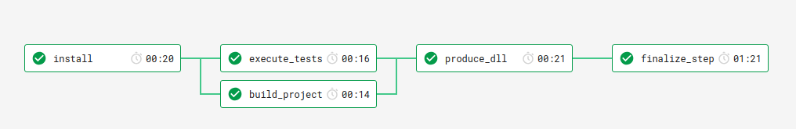

# CircleCI integration
Starter.Net is using CircleCI for it's powerful build pipelines to ensure each change works as intended.

The following visualization will help understanding build flow better moving forward:



## Install Phase
First step is to install project dependencies. This is done inside a docker container which contains dotnet sdk

The command used is: `dotnet restore`

It uses /home/circleci/Starter.Net as working directory because circle ci seems to have trouble when restoring cache stored from inside docker
to machine's file system, it's because docker is ran as `root` and machine uses `circleci` user.
After restoring packages, we save the current path to cache so we can use in next build steps.

## Verification Phase

Verification has two jobs, one being `execute_tests` and other being `build_project` since there's no reason for tests
to wait for build to finish, they execute in parallel, but they both only run after `install` phase is done just as seen on screenshot

### execute tests

This step simply restores the files from cache, runs tests and exits.

### build_project
This step also restores files from cache, runs a build and exits.

## Produce DLL
On this phase, we restore the original contents from install phase (which already contains dependencies),
run a `dotnet publish -c Release -o out` which will create the binaries in out directories.

This is than cached for usage later.

Produce dll waits for both jobs in verification phase to finish.

## Finalize
Finally when tests, builds, and any other prerequisites are satisfied, finalize builds docker image,
and tags with appropriate tags. Each build will tag an image with short commit message.
If branch is master, it'll also tag as latest, and if it's a tag build, it'll tag as same tag and pushes to docker hub.

Resulting image can be run locally once the build passes using simple:

```bash
docker run fossapps/starter.net:tag
```
Where tag can be either `latest` or any github tag (or the short commit hash)

Please note that length short commit hash might change if ambiguity arises (this happens when project grows more)

To find exact tag, you can see circle ci build and find tag that way,
or if you know a commit was built (if a push included multiple commits, only last commit will be built)
then you can simply search for tag with matching hash.

**Note: The dll produced from Produce DLL phase isn't used yet as I could not find an image with exact same version of dotnet runtime hence image is built from scratch again, but that should change soon**
